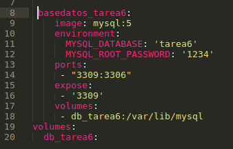
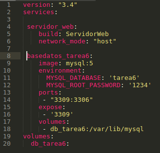

# SA_Tarea6_201213181

La tarea 6 consiste en dos contenedores **DOCKER** que involucran:

> Servidor Web

> Base de datos

Para esto se utilizaron Dockerfiles y Docker-compose.yml

**SERVIDOR WEB**

Para el servidor web se utilizo lo siguiente en el DockerFile:

	FROM node:9-slim
	WORKDIR /app
	COPY package.json /app
	RUN npm install
	COPY . /app
	EXPOSE 8080
	CMD ["npm","start"]

A continuación se explica las previas lineas de codigo:

1. La primera linea es la imagen que se usara desde Docker Hub.

2. La segunda linea es la carpeta de trabajo que se usara en el container

3. En la 3era y 4ta línea se copia el archivo "package.json" al directorio de trabajo y luego se instalan las dependencias por medio de NPM.

4. Por ultimo se copia los archivos locales en el directorio de trabajo del contenedor, se expone el puerto 8080 y se inicia el servidor.

**BASE DE DATOS**

Cabe destacar que para la base de datos se utilizaron volumenes, esto para que la informacion pudiera ser persistente. 

Lo primero es crear un volumen:

	docker volume create db_tarea6

Ahora que el volumen esta creado localmente solo queda utilizarlo para que el contenedor de MYSQL lo pueda utilizar. Esto se configuró en el archivo Docker-compose.yml:

Quedando el archivo docker-compose.yml de la siguiente manera:

Este archivo **.yml** en la linea 1 y 2 se pone la version del archivo que se estara utilizando para la sintaxis, luego en la línea 2 se comienzan a poner los servicios.

1. A el primer servicio se le llama **servidor_web**, el comando build espera encontrar un archivo Docker en la carpeta "ServidorWeb", el tipo de red sera "host".

2. Luego al segundo servicio se le llama **basedatos_tarea6**, luego en la línea 9 se descarga la imagen de MySQL:5 y en las líneas subsiguientes se coloca la configuracion como el nombre de la base de datos y la contraseña. 

3. El contenedor de MYSQL corre en el puerto 3306 pero debemos mapear al puerto 3309 para poder acceder al contenedor y este puerto tambien debe ser expuesto.

4. Por ultimo en la línea 18 se monta el volumen previamente creado en la dirección "/var/lib/mysql" dentro del contenedor ya que en esta dirección es donde MYSQL hace la escritura. 